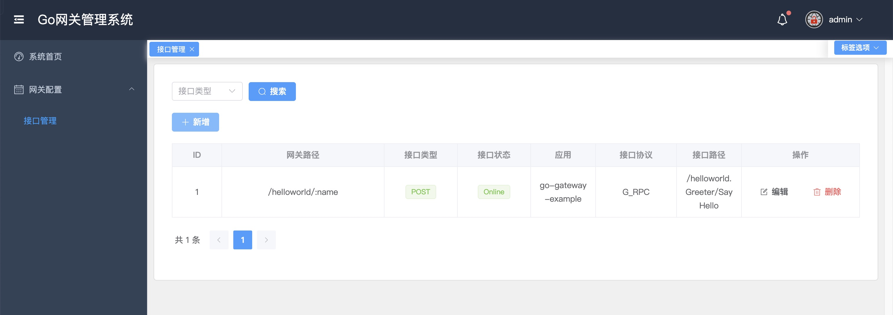

# 基于go实现分布式网关

# ❓为啥要做这个系统

后端是`gRPC`接口，前端是通过`http`的方式。为了能够让前端通过http方式调用，不得不使用`gin`或者`gRPC-Gateway`暴露一个`http`的接口，这种方式`太麻烦了`，也太`重复`了。通过`go网关`就可以实现`gRPC泛化调用`，后端只需要维护gRPC接口即可，网关负责协议转换。

# grpc泛化调用方式

## grpc服务直接支持json编码

> 1、文章：http://www.baker-yuan.cn/articles/317
>
> 2、案例：https://github.com/go-kratos/gateway/blob/main/middleware/transcoder/transcoder.go

## grpc服务开启反射

> 1、文章：http://www.baker-yuan.cn/articles/294
>
> 2、案例：https://github.com/eolinker/apinto/blob/v0.12.5/drivers/plugins/http-to-gRPC/complete.go

## 通过proto文件调用

> 1、文章：http://www.baker-yuan.cn/articles/294
>
> 2、案例：https://github.com/eolinker/apinto/blob/v0.12.5/drivers/plugins/http-to-gRPC/complete.go

# 用到的框架

## grpcurl

> grpcurl是一个命令行工具，使用它可以在命令行中访问gRPC服务，就像使用curl访问http服务一样。
> https://github.com/fullstorydev/grpcurl
>
> 文章：
>
> 1、http://www.baker-yuan.cn/articles/294
>
> 2、http://www.baker-yuan.cn/articles/292

## fasthttp

> fasthttp是一个高性能的HTTP服务器框架，它是Go语言中最快的HTTP服务器之一。它的设计目标是实现高吞吐量和低延迟，以满足高并发的需求。
>
> fasthttp相较于标准库中的http包，有以下优势：
> 1. 更快的性能：fasthttp使用了更加高效的内存管理和I/O复用机制，能够实现更高的吞吐量和更低的延迟。
> 2. 更少的内存占用：fasthttp的内存管理非常精细，能够避免不必要的内存分配和释放，减少内存占用。
> 3. 更易于扩展：fasthttp提供了丰富的中间件和插件机制，可以方便地进行定制和扩展。
> 4. 更多的功能：fasthttp支持HTTP/1.1和HTTP/2协议，同时还支持WebSocket、TLS和gzip等功能。
>
> https://pkg.go.dev/github.com/valyala/fasthttp

## httprouter

> https://github.com/julienschmidt/httprouter
>
> chatGPT：
> httprouter是一个轻量级的Go语言HTTP请求路由器，它能够高效地处理HTTP请求，并支持RESTful API的设计。它的主要特点包括：
> 1. 高性能：httprouter使用了trie树的算法来实现路由匹配，比常规的正则表达式匹配更快。
> 2. 简单易用：httprouter的API非常简单，只需要调用一个函数并传入路由和处理函数即可。
> 3. 支持RESTful API：httprouter支持HTTP请求的GET、POST、PUT、DELETE等RESTful API，可以快速地设计和开发RESTful API。
> 4. 支持中间件：httprouter支持中间件，可以在路由处理函数之前或之后执行一些自定义的逻辑。
> 5. 可扩展性强：httprouter的代码非常简洁，易于扩展和修改，可以根据实际需求进行定制化开发。
>
> 总之，httprouter是一个简单、高效、易用、可扩展的Go语言HTTP请求路由器，非常适合用于构建高性能的Web应用程序和RESTful API。

> 文章：http://www.baker-yuan.cn/articles/322

## kratos

> Kratos 一套轻量级 Go 微服务框架，包含大量微服务相关功能及工具。
>
> https://github.com/go-kratos/kratos

## protoreflect

> 用于在Go语言中反射和操作Protocol Buffers（protobuf）消息的库。它允许您动态地读取、写入和修改protobuf消息，而无需生成代码或使用特定的结构体。该库还支持在运行时动态生成protobuf消息，并支持使用JSON和文本格式的消息序列化和反序列化。
>
> https://github.com/jhump/protoreflect

> 文章：http://www.baker-yuan.cn/articles/295

## Polaris

> 北极星是一个支持多语言和多框架的服务发现和治理平台，致力于解决分布式和微服务架构中的服务管理、流量管理、故障容错、配置管理和可观测性问题，针对不同的技术栈和环境提供服务治理的标准方案和最佳实践。
>
> https://github.com/polarismesh/polaris

## vue-manage-system

> 该方案作为一套多功能的后台框架模板，适用于绝大部分的后台管理系统开发。基于 Vue3 + pinia + typescript，引用 Element Plus 组件库，方便开发。实现逻辑简单，适合外包项目，快速交付。
>
> https://github.com/lin-xin/vue-manage-system

# 开源网关推荐

## B站开源的简单网关

> A high-performance API Gateway with middlewares, supporting HTTP and gRPC protocols.
>
> https://github.com/go-kratos/gateway

这个项目处于起步阶段，不是很成熟，无法直接用于生产环境。

## Apache ShenYu

> 这是一个异步的，高性能的，跨语言的，响应式的 `API` 网关。基于Java实现，文档丰富，值得推荐。
>
> https://github.com/apache/shenyu

## Apinto

> Apinto 是专门为微服务架构设计的开源 API 网关，完全由 Go 语言开发，拥有目前市面上最强的性能及稳定性表现，并且可以自由扩展几乎所有功能模块。 提供丰富的流量管理、数据处理、协议转换等功能，例如动态路由、负载均衡、服务发现、熔断降级、身份认证、监控与告警等。
>
> https://github.com/eolinker/apinto

> 悟空API网关升级版本
>
> - https://github.com/eolinker/goku_lite
> - https://community.apinto.com/d/34051-apinto-gateway
>
> - https://community.apinto.com/d/34044-gokuapinto

EOLINKER 旗下的微服务网关，都有对应的商业版本。开源版本感觉抠抠搜搜的。

# 学习资料

## 美团技术团队文章

> 百亿规模API网关服务Shepherd的设计与实现：https://tech.meituan.com/2021/05/20/shepherd-api-gateway.html

## 【小傅哥】API网关：中间件设计和实践

> https://wx.zsxq.com/dweb2/index/topic_detail/184422812115512

## Vue+Go 开发企业级微服务网关项目

> 本课程带你手把手设计并实现一个通用型前端+后端一体的微服务网关项目，同时利用Go语言本身的性能优势，打造网关的优越性能，提升自身硬实力，还能收获微服务网关项目作品，丰富个人简历。
>
> https://coding.imooc.com/class/436.html

## Netty+Nacos+Disruptor自研企业级API网关

> 大部分一线开发人员自研开发能力都比较薄弱，导致难进大厂或晋升受阻，进而阻碍了个人的职业发展。为此，慕课网重磅推出自研网关课程，课程将带你系统掌握自研网关的完整流程，并手把手实践与落地整套方法论，助力你成为自研组件高手，过程中综合运用“三高”主流技术栈，全面提升高阶技能，突破职业发展瓶颈。
>
> https://coding.imooc.com/class/655.html

# 项目截图

## 接口列表

## 新增gRPC接口

## 心中Http接口